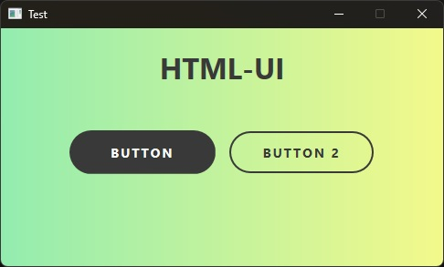
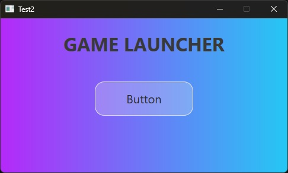

<h1 align="center">
	HTML-UI
	<br>
	<a href="https://github.com/momo5502/html-ui/actions"></a>
	<a href="https://github.com/momo5502/html-ui/issues"></a>
	
</h1>


Internet Explorer 11 based HTML UI component for C++.

Due to employing Internet Explorer 11, html-ui offers a flexible and lightweight HTML user interface.
It is ideal for small, yet elegant user interfaces.

No external dependencies are required resulting in minuscule binary sizes.

## Preview

<p align="center">

&nbsp;

</p>

## Usage

You can start by creating a window with native `testFunction` handler:

```c++
#include <momo/html_ui.hpp>

int main()
{
    momo::html_ui window("Test", 500, 300);

    window.register_handler("testFunction", [](const std::string& text) -> int
    {
		// ...
		return 15;
    });

    window.load_html("<!DOCTYPE html><html> ... </html>");

    momo::html_ui::show_windows();
}
```

Native handlers can be called from JavaScript:

```js
window.external.testFunction("Hello World");
```

Javascript execution from C++ is also possible:

```c++
const auto result = window.evaluate("alert('test')");
```

The JavaScript values are automatically translated to match the C++ function signature.
If the arguments mismatch, an exception is thrown.

Alternatively, a raw handler can be registered, which receives all arguments as vector:

```c++
window.register_raw_handler("rawFunction", [&window](const std::vector<momo::html_value>& arguments)
	-> momo::html_value
{
	// ...
	return {};
});
```
